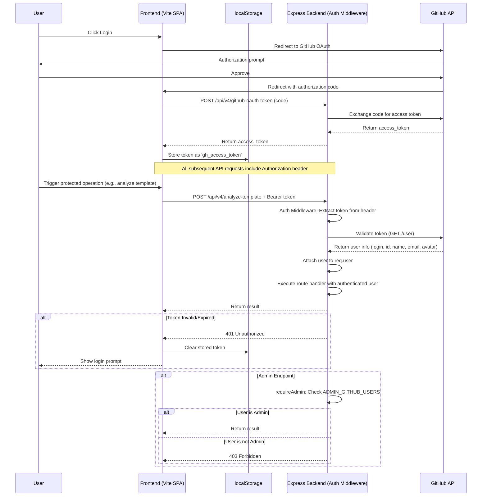
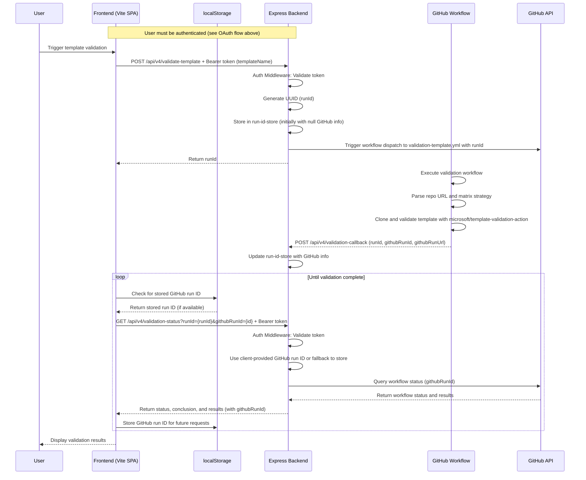
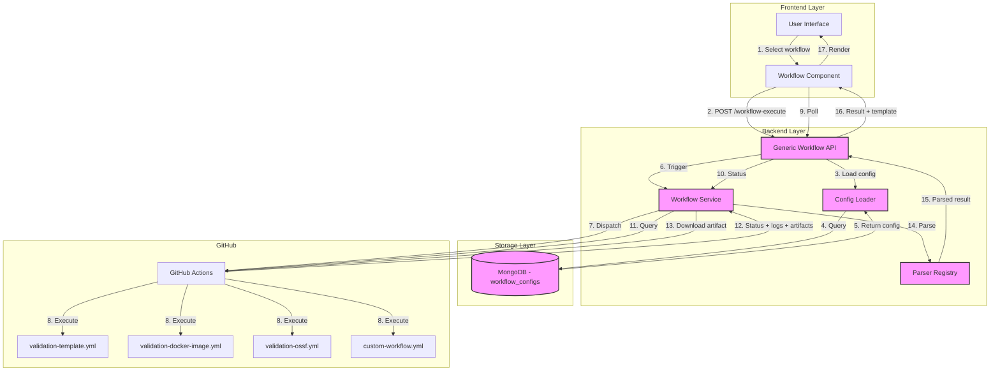
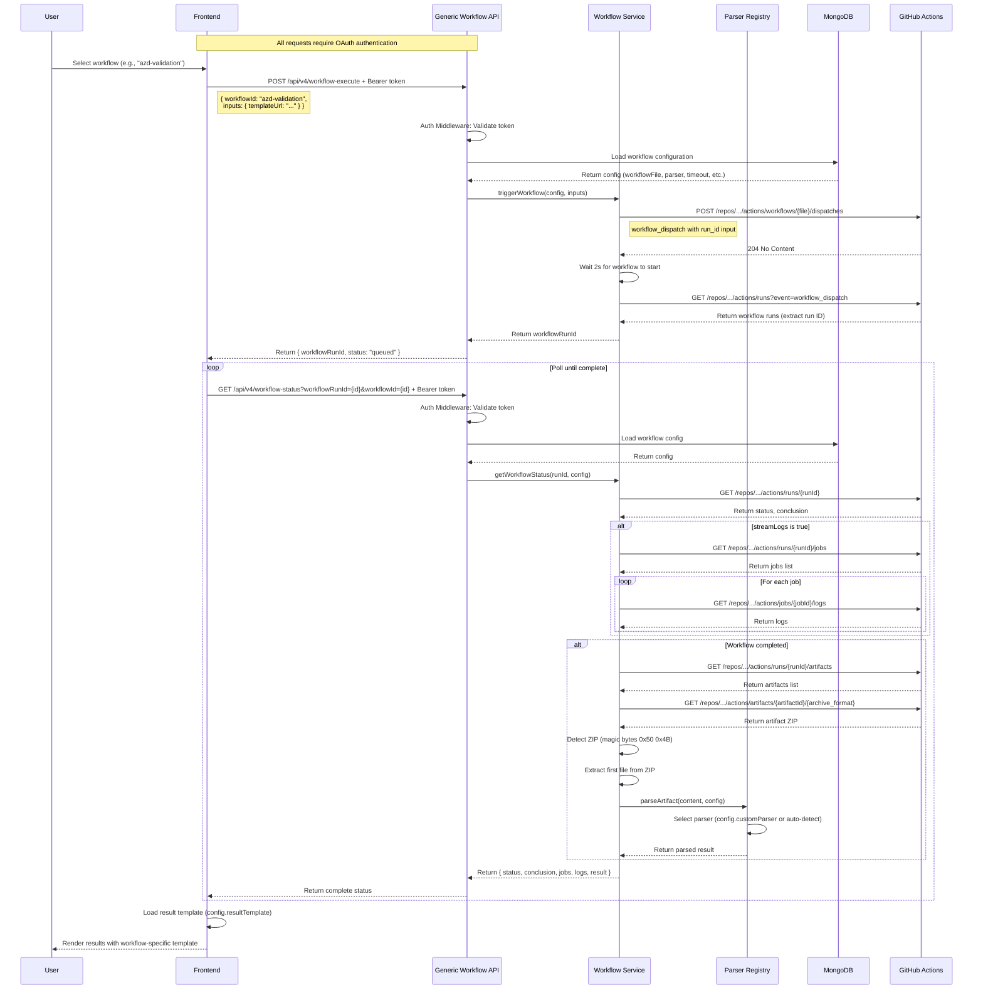
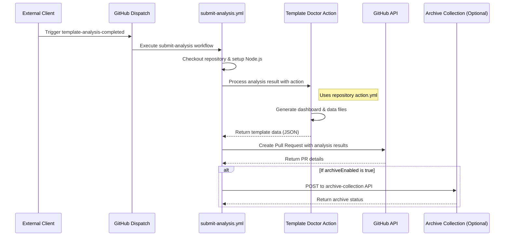
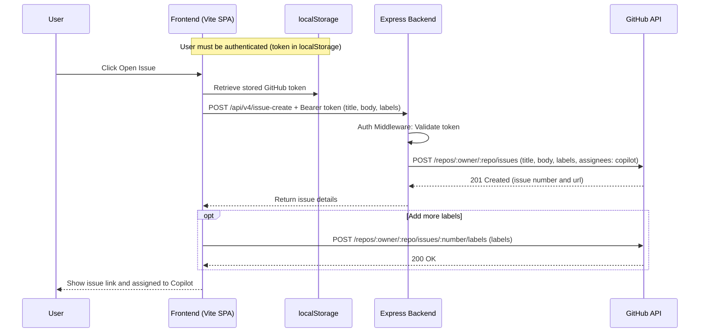

# Template Doctor – Architecture Overview

## Containerized Express Architecture

Template Doctor has migrated from Azure Functions to a containerized Express server architecture. The application now runs as Docker containers, providing better local development experience, easier deployment, and more flexibility in hosting options.

### Components

- **Express Backend** (`packages/server`): TypeScript-based REST API running on port 3001
- **Static Frontend** (`packages/app`): Vite-built SPA running on port 3000 (preview) or 4000 (dev)
- **Docker**: Multi-container (docker-compose) and single-container (Dockerfile.combined) deployment options
- **Legacy Azure Functions**: Preserved in `dev/api-legacy-azure-functions` branch for historical reference

## OAuth 2.0 Authentication Flow

Template Doctor uses OAuth 2.0 with GitHub for API authentication. The frontend handles the OAuth flow automatically, and all protected endpoints validate GitHub tokens on every request.



**Endpoint Protection:**

- **Public Endpoints**: No authentication required
  - `/api/health` - Health check
  - `/api/v4/client-settings` - Runtime configuration
  - `/api/v4/github-oauth-token` - OAuth token exchange

- **Protected Endpoints**: Require valid GitHub token
  - `/api/v4/analyze-template` - Template analysis
  - `/api/v4/validate-template` - Trigger validation
  - `/api/v4/validation-*` - All validation endpoints
  - `/api/v4/issue-create` - Create GitHub issue
  - `/api/v4/action-*` - GitHub Actions endpoints
  - `/api/v4/batch-scan-start` - Batch analysis

- **Admin Endpoints**: Require authentication + admin privileges
  - `/api/admin/*` - Admin configuration and debugging
  - `/api/v4/admin/*` - Admin settings management

**Authentication Middleware:**

The Express backend uses three middleware functions:

1. `requireAuth` - Validates token, attaches user to request, or returns 401
2. `optionalAuth` - Validates token if present, never returns 401
3. `requireAdmin` - Checks user is in ADMIN_GITHUB_USERS list, or returns 403

See [OAuth API Authentication](./OAUTH_API_AUTHENTICATION.md) for detailed documentation.

---

## Template Validation Flow

This diagram shows how the frontend, Express backend, and GitHub workflow interact during the template validation flow, with client-side storage of GitHub run IDs.



Notes:

- The in-memory run-id-store maps internal UUIDs to GitHub workflow run IDs and URLs
- The frontend stores GitHub run IDs in localStorage to maintain mapping across browser sessions
- When polling for status, the frontend includes the stored GitHub run ID in the request
- This provides resilience against Function App restarts, which would otherwise lose the in-memory mapping
- The status endpoint queries the GitHub API with either the client-provided run ID or falls back to in-memory store
- The validation workflow includes additional steps like location determination, repository cloning, and running the microsoft/template-validation-action

---

## Generic Workflow Execution System

**NEW**: Template Doctor now supports a unified workflow execution system that allows triggering any GitHub Actions workflow without creating new endpoints. This system replaces the pattern of creating workflow-specific endpoints (like `/validate-template`, `/docker-scan`, etc.) with a single generic execution framework.

### Architecture Overview



### Generic Workflow Flow



### Key Components

1. **Workflow Configuration** (`workflow_configs` MongoDB collection):
   - Stores workflow metadata: `id`, `name`, `workflowFile`, `artifactCompressed`, `streamLogs`, `customParser`, `resultTemplate`, `defaultInputs`, `timeout`
   - Loaded on server startup via `initializeWorkflowConfigs()`
   - Configurable via `/api/v4/setup` endpoint (admin only)

2. **Workflow Service** (`packages/server/src/services/workflow-service.ts`):
   - `triggerWorkflow()`: Dispatches GitHub workflow with run_id input
   - `getWorkflowStatus()`: Fetches status + jobs + logs + artifacts
   - `cancelWorkflow()`: Cancels running workflow
   - `downloadArtifact()`: Auto-detects ZIP, extracts, returns content
   - `fetchJobLogs()`: Streams logs from all jobs

3. **Parser Registry** (`packages/server/src/services/workflow-parser-registry.ts`):
   - Built-in parsers: `markdown`, `log`, `json`, `azd-validation`
   - Custom parser registration via `registerParser(name, parserFn)`
   - Auto-detection based on content type

4. **Generic API Endpoints** (`packages/server/src/routes/generic-workflow.ts`):
   - `GET /api/v4/workflows` - List all workflow configurations
   - `POST /api/v4/workflow-execute` - Trigger workflow (requires auth)
   - `GET /api/v4/workflow-status` - Poll status with logs/results (requires auth)
   - `POST /api/v4/workflow-cancel` - Cancel workflow (requires auth)

### Default Workflows

The system includes three pre-configured workflows:

| Workflow ID         | GitHub Actions File          | Timeout | Stream Logs | Parser         |
|---------------------|------------------------------|---------|-------------|----------------|
| azd-validation      | validation-template.yml      | 10 min  | Yes         | azd-validation |
| docker-image-scan   | validation-docker-image.yml  | 5 min   | No          | markdown       |
| ossf-scorecard      | validation-ossf.yml          | 5 min   | No          | json           |

### Adding New Workflows

**CRITICAL**: Do NOT create new specific endpoints for workflows. Use the generic system:

1. Create GitHub Actions workflow file (`.github/workflows/my-workflow.yml`)
   - Must support `workflow_dispatch` trigger
   - Must accept `run_id` input parameter
   - Should upload artifacts with results

2. Configure workflow in MongoDB via `/api/v4/setup` (admin) or programmatically:
   ```javascript
   {
     id: "my-workflow",
     name: "My Workflow",
     workflowFile: "my-workflow.yml",
     artifactCompressed: true,
     streamLogs: true,
     customParser: "markdown",
     defaultInputs: { param: "value" },
     timeout: 300000
   }
   ```

3. Use generic endpoints from frontend:
   ```javascript
   // Trigger
   const { workflowRunId } = await fetch('/api/v4/workflow-execute', {
     method: 'POST',
     headers: { 'Authorization': `Bearer ${token}` },
     body: JSON.stringify({ workflowId: 'my-workflow', inputs: { ... } })
   });

   // Poll status
   const status = await fetch(`/api/v4/workflow-status?workflowRunId=${runId}&workflowId=my-workflow`, {
     headers: { 'Authorization': `Bearer ${token}` }
   });
   ```

4. (Optional) Register custom parser if needed:
   ```typescript
   import { registerParser } from './services/workflow-parser-registry';
   registerParser('my-parser', (content, config) => {
     // Parse logic
     return parsedResult;
   });
   ```

### Benefits

- ✅ **No Code Changes**: Add workflows via configuration, not code
- ✅ **Unified API**: Single set of endpoints for all workflows
- ✅ **Automatic Features**: ZIP extraction, log streaming, parsing
- ✅ **Extensible**: Custom parsers for any artifact format
- ✅ **Consistent Auth**: All workflows use OAuth authentication
- ✅ **Result Templates**: Workflow-specific rendering

### Documentation

- **System Architecture**: [GENERIC_WORKFLOW_SYSTEM.md](./GENERIC_WORKFLOW_SYSTEM.md)
- **User Guide**: [NEW_WORKFLOW_GUIDE.md](./NEW_WORKFLOW_GUIDE.md)
- **AI Agent Guidance**: [AGENTS.md](../../AGENTS.md#adding-new-workflows-critical-guidance-for-agents)

---

## Submit Analysis Workflow

This diagram shows how the Template Doctor processes and submits analysis results to be stored in the repository.



Notes:

- The submit-analysis workflow is triggered by a repository_dispatch event of type "template-analysis-completed"
- The workflow uses the Template Doctor action (action.yml in the repository root) to process analysis results
- The action generates dashboard HTML and data JS files for the analyzed template
- A pull request is created to add these files to the repository
- Optionally, results can be archived to a central collection if configured

## GitHub issue creation flow

This diagram shows how the frontend uses the Express OAuth endpoint to exchange the code for a token and then opens a GitHub issue, applying labels and assigning it to Copilot. **Note: Issue creation now requires authentication.**



## Overall System Architecture

The following diagram illustrates the high-level containerized system architecture of Template Doctor:

```mermaid
graph TB
    User((User))

    subgraph "Frontend Container (Vite SPA)"
        UI[Web UI]
        ResultsViewer[Results Viewer]
        BatchManager[Batch Manager]
        NotificationSystem[Notification System]
    end

    subgraph "Express Backend Container"
        AnalyzeAPI[/api/v4/analyze]
        ConfigAPI[/api/v4/client-settings]
        AuthAPI[/api/v4/github-oauth-token]
        ValidateAPI[/api/v4/validate-template]
        StatusAPI[/api/v4/validation-status]
        CallbackAPI[/api/v4/validation-callback]
        ArchiveAPI[/api/v4/archive-collection]
    end

    subgraph "Docker Deployment"
        DockerCompose[docker-compose.yml]
        SingleContainer[Dockerfile.combined]
    end

    subgraph "GitHub Workflows"
        ValidationWorkflow[validation-template.yml]
        SubmitAnalysis[submit-analysis.yml]
    end

    subgraph "Storage"
        localStorage[(localStorage)]
        ResultsRepo[(GitHub Pages Results)]
    end

    User --> UI
    UI --> BatchManager
    UI --> NotificationSystem
    UI --> ResultsViewer

    BatchManager --> AnalyzeAPI
    UI --> ValidateAPI
    UI --> StatusAPI
    UI --> AuthAPI
    UI --> ConfigAPI

    AnalyzeAPI --> GitHub
    ValidateAPI --> ValidationWorkflow
    ValidationWorkflow --> CallbackAPI
    CallbackAPI --> StatusAPI

    ValidationWorkflow --> SubmitAnalysis
    SubmitAnalysis --> ResultsRepo
    SubmitAnalysis --> ArchiveAPI

    StatusAPI --> localStorage
    localStorage --> StatusAPI

    ResultsRepo --> ResultsViewer

    AuthAPI --> GitHub

    DockerCompose -.-> UI
    DockerCompose -.-> AnalyzeAPI
    SingleContainer -.-> UI
    SingleContainer -.-> AnalyzeAPI

    class UI,BatchManager,ResultsViewer,NotificationSystem highlight
    class AnalyzeAPI,ConfigAPI,AuthAPI,ValidateAPI,StatusAPI,CallbackAPI,ArchiveAPI highlight
    class ValidationWorkflow,SubmitAnalysis highlight

    classDef highlight fill:#f9f,stroke:#333,stroke-width:2px
```

## Deployment Options

### Local Development

**Two-Terminal Approach (Recommended):**

Terminal 1 - Express Backend:

```bash
cd packages/server
npm run dev  # Runs on port 3001
```

Terminal 2 - Vite Frontend:

```bash
cd packages/app
npm run dev  # Runs on port 4000
```

**Production Preview:**

```bash
cd packages/app
npm run preview  # Runs on port 3000
```

### Docker Deployment

**Multi-Container (Development):**

```bash
docker-compose up
```

- Frontend: http://localhost:3000
- Backend: http://localhost:3001

**Single Container (Production):**

```bash
docker build -f Dockerfile.combined -t template-doctor .
docker run -p 80:80 template-doctor
```

- All services: http://localhost

### Port Allocation

| Service                  | Development | Preview | Docker (Multi) | Docker (Single) |
| ------------------------ | ----------- | ------- | -------------- | --------------- |
| Vite Dev Server          | 4000        | -       | -              | -               |
| Vite Preview             | -           | 3000    | 3000           | -               |
| Express Backend          | 3001        | 3001    | 3001           | -               |
| Nginx (Combined)         | -           | -       | -              | 80              |
| Azure Functions (Legacy) | 7071        | 7071    | -              | -               |

## Migration Status

### Completed Migrations

✅ **Core API Endpoints:**

- `/api/v4/analyze` - Template analysis with fork-first SAML strategy
- `/api/v4/github-oauth-token` - OAuth token exchange
- `/api/v4/client-settings` - Runtime configuration

✅ **Infrastructure:**

- Docker Compose configuration for multi-container deployment
- Combined Dockerfile for single-container production deployment
- Environment variable consolidation
- CORS and security configuration

### Pending Migrations (17 Functions)

The following Azure Functions remain to be migrated to Express endpoints:

**Validation Workflow:**

- `validate-template` → `/api/v4/validate-template`
- `validation-status` → `/api/v4/validation-status`
- `validation-callback` → `/api/v4/validation-callback`
- `validation-cancel` → `/api/v4/validation-cancel`
- `validation-docker-image` → `/api/v4/validation-docker-image`
- `validation-ossf` → `/api/v4/validation-ossf`

**GitHub Actions:**

- `action-trigger` → `/api/v4/action-trigger`
- `action-run-status` → `/api/v4/action-run-status`
- `action-run-artifacts` → `/api/v4/action-run-artifacts`

**Analysis & Submission:**

- `submit-analysis-dispatch` → `/api/v4/submit-analysis-dispatch`
- `add-template-pr` → `/api/v4/add-template-pr`
- `archive-collection` → `/api/v4/archive-collection` ✅ (migrated)

**Repository Management:**

- `repo-fork` → `/api/v4/repo-fork`
- `batch-scan-start` → `/api/v4/batch-scan-start`

**Issue Management:**

- `issue-create` → `/api/v4/issue-create`
- `issue-ai-proxy` → `/api/v4/issue-ai-proxy`

**Setup:**

- `setup` → `/api/v4/setup`

### Legacy Branch

Azure Functions code is maintained in the `dev/api-legacy-azure-functions` branch for historical reference.

```

```
